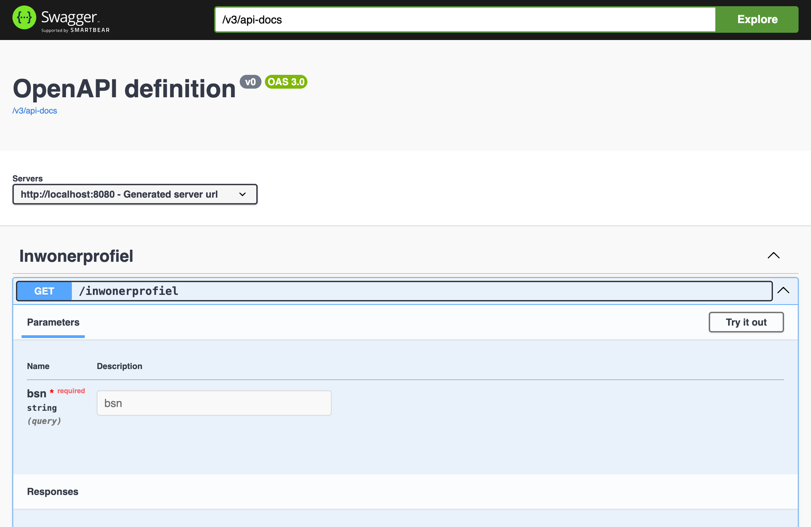
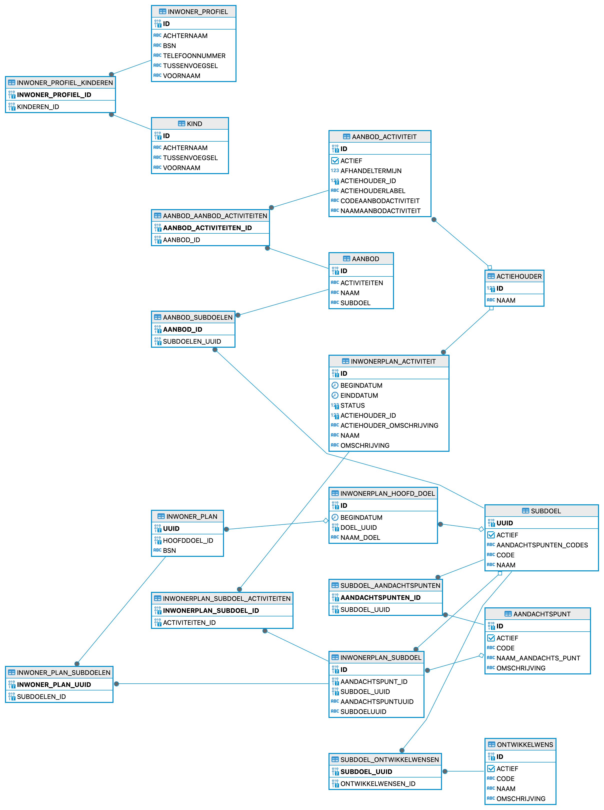

# Functionele specs voor de APP

Deze API ondersteund een aantal functionele cases waarmee in de oude oplossing problemen waren. Deze API is niet bedoeld als productiewaardige software, de code is op POC niveau, puur om productinnovatie mee te verifieren.
De applicatie bevat stamtabeldata vergelijkbaar met productie, alleen de mapping van aanbod op subdoelen is onjuist.

## API gebruiken
Je kunt de API starten door `./gradlew bootRun` te typen in de commandline of vanuit intellij (java21).
In je browser kun je vervolgens in [swaggerui](http://localhost:8080/swagger-ui/index.html) de api testen
Om de api met een frontend app te gebruiken zullen er nog wat [cors spring instellingen](https://www.baeldung.com/spring-cors) gezet moeten worden

## Swagger UI / OpenApi
Swagger UI / OpenApi is een standaard formaat om rest api's mee te specificeren, documenteren en gebruiken. Het is hierbij mogelijk om code te genereren en een test client gebruiken.

## Datamodel
Hieronder een overzicht van het databaseschema zoals dat in deze versie van de api gebruikt wordt. Dit database schema wordt gegenereerd vanuit de code.

## Applicatieomschrijving
De inwonerplan applicatie kent 2 cases:
1. Een aanvraag indienen
2. Een aanvraag bijwerken

## Aanvraag indienen
De aanvraag is een proces dat bestaat uit meerdere stappen.
* Een aanvraag indienen begint met het invullen van wat persoonlijke informatie in het inwonerprofiel.
* Daarna kan men 1 of meer subdoelen kiezen
* In de volgende stap kan men bij elk subdoel 1 of meer aandachtspunten kiezen
* In de daarop volgende stap kan je bij elk subdoel 1 of meer aanbod kiezen
* In de daarop volgende stap krijg je bij elk aanbod vooringevuld de aanbod activiteiten te zien. Deze kan de coach aanpassen
* In de laatste stap kies je het hoofddoel
* Vervolgens sla je alle data op

Er zijn ook [schermafbeeldingen](documentation/stappen.md).

## Aanvraag bijwerken
De aanvraag bijwerken bestaat uit dezelfde stappen als aanvragen. In de basis zie je wat je eerder hebt ingevuld, kun je nieuwe dingen toevoegen.
* Een aanvraag bijwerken begint met het reviewen en eventueel corrigeren van het inwonerprofiel.
* Daarna zie je de eerder gekozen subdoelen; je kunt nieuwe subdoelen toevoegen
* In de volgende stap kan men bij elk nieuw subdoel 1 of meer aandachtspunten kiezen. Aan de reeds bestaande subdoelen kunnen nieuwe aandachtspunten worden toegevoegd maar bestaand kan niet gewijzigd worden 
* In de daarop volgende stap kan je bij elk nieuw subdoel 1 of meer aanbod kiezen. Aan de reeds bestaande subdoelen kan nieuw aanbod worden toegevoegd maar bestaand kan niet gewijzigd worden
* In de daarop volgende stap krijg je bij elk nieuw aanbod vooringevuld de aanbod activiteiten te zien. Deze kan de coach aanpassen
* Bij bestaand aanbod kun je de eerder gekozen waardes zien
* In de laatste stap zie je het hoofddoel.
* Vervolgens sla je alle data op

